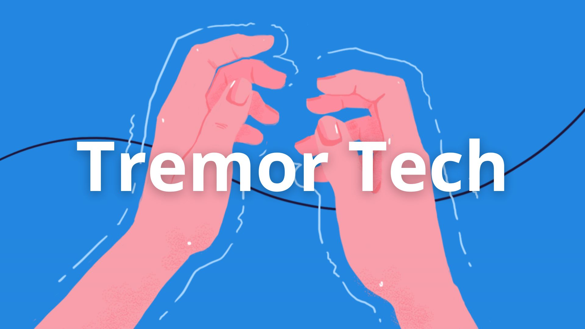

## Problem Statement:
Parkinson's disease (PD) is a progressive neurological disorder primarily affecting individuals aged 60 and older globally. Approximately 15% of Parkinson's disease cases have a familial component attributed to genetic mutations in specific genes, while environmental factors such as exposure to toxins like farming chemicals and heavy metals like manganese can also contribute to Parkinson 's-like symptoms. 
### It manifests through:
- Tremors in the hands, arms, legs, jaw, or head.
- Muscle stiffness.
- Slowness of movement.
- Improper mobility.
- Impaired balance and coordination.
- Loss of sense of smell.

Sudden muscle stiffness can lead to falls and accidents, significantly impacting daily life. In India, around 7 million older adults suffer from PD, with a projected global increase of 200-300% in the coming decades, according to experts1. Over the past 25 years, PD prevalence has doubled, with global estimates in 2019 surpassing 8.5 million cases. PD caused 5.8 million disability-adjusted life years (DALYs) and 329,000 deaths in 2019, marking an 81% and 100% increase since 2000 2, respectively. Addressing this growing burden requires concerted efforts in research, awareness, and access to effective treatments to mitigate its debilitating effects on individuals and societies.

## 🚀 Our Solution:
An innovative wearable device designed to manage motor symptoms of Parkinson's Disease (PD), specifically tremors and muscle stiffness. This automatic and semi-automatic solution features a flexible, biocompatible sensor array that detects abnormal muscle activity through Galvanic Skin Response and Electromyogram sensors. It delivers targeted haptic vibrations to alleviate symptoms while tailored for ease of use and affordability. Offering a safe, non-invasive alternative to traditional treatments, this device enhances patient freedom and quality of life, filling a significant gap in Parkinson's Disease management.

# WHAT IS UNIQUE ABOUT US?

## 🚀 What we are solving:
- Parkinson's Disease presents complexities, notably in its initial stages, where individuals experience tremors affecting various body parts, particularly the limbs. This often leads to sudden falls, getting stuck in positions, and other challenges that directly impact the affected person's confidence and mental well-being. Our innovative device addresses these specific situations by offering neuromodulator stimulation, effectively halting muscle freezing and shaking and providing much-needed support for individuals dealing with Parkinson's symptoms.
- Our device is designed for effortless use—simply calibrate it once, put it on, and experience newfound independence. Say goodbye to relying on others.
- Our product is not only more effective in daily use but also 10 times more cost-efficient than current alternatives like medications and therapy centres. Choose affordability without compromising on quality.
- Unlike medications with potential side effects and the uncertainty of inadequately trained therapists, our solution offers a worry-free alternative. Experience the benefits without concerns—no side effects and no fears associated with untrained professionals. 
